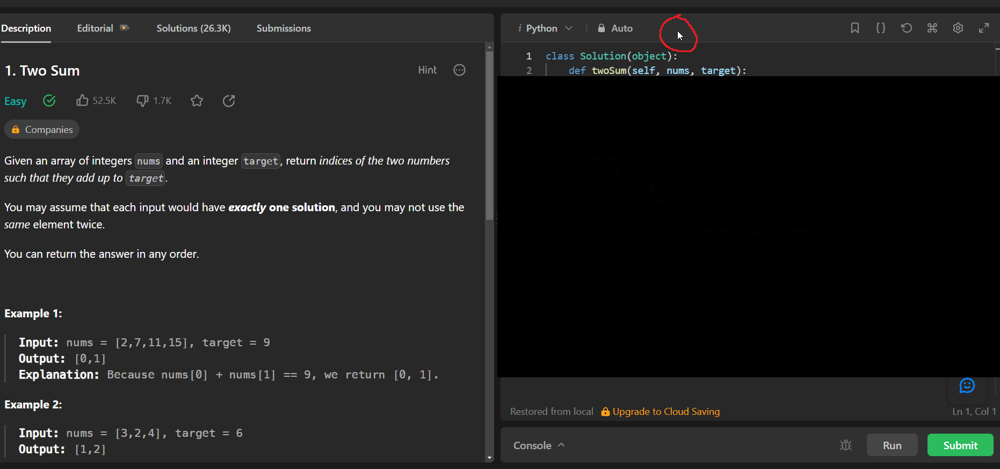

<h1 align="center">Leetcode Blurring</h1>

## Overview

LC-blurring is a Chrome Extension I made to help myself study Leetcode problems that I've already done. All it does is block the code editor, which usually has the solution if I have done the problem before. To remove the box, just click the top bar with the language, save problem button, reset code button, etc. (as seen in screenshot).

To use:
1) Download and unzip the repository.
2) Go to chrome://extensions/ and activate developer mode on the top-right.
3) Click "load unpacked" and select the "lc-blurring" folder.
